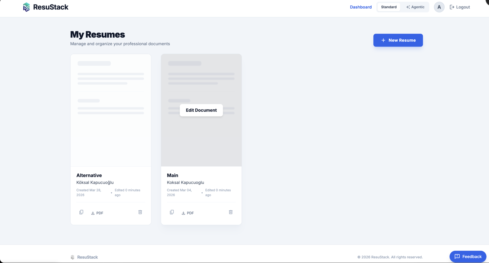
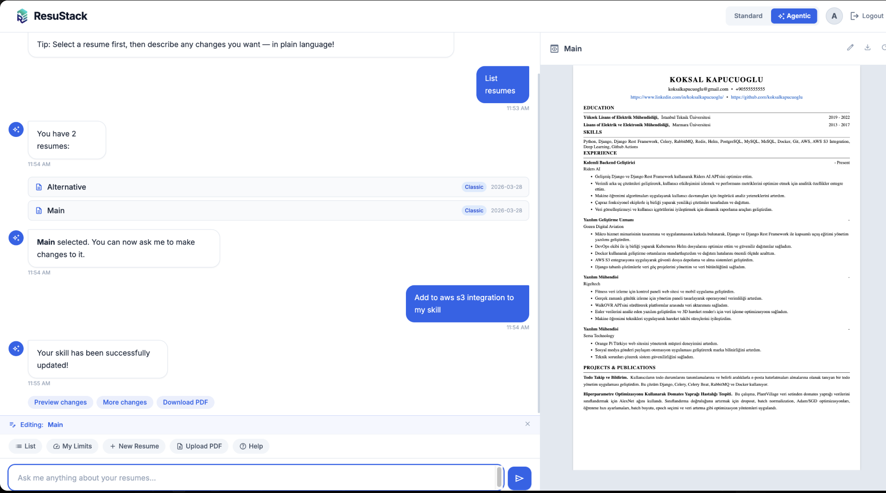
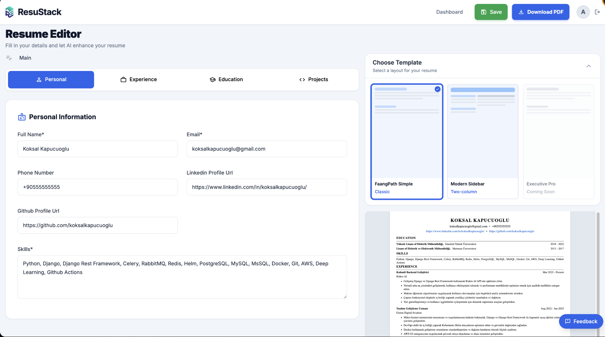

# ResuStack

**ResuStack** is an AI-powered resume builder that helps you create professional, ATS-optimized resumes in minutes. Import from LinkedIn, upload a PDF, or start from scratch — then let AI do the heavy lifting.

🔗 **Live:** [resustackapp.com](https://resustackapp.com)

---

## ✨ Features

### Resume Builder
- **PDF & LinkedIn Import** — Upload your existing resume or LinkedIn PDF; AI extracts and organizes your data automatically
- **Blank Resume** — Start from scratch with a structured form editor
- **Live Preview** — Split-pane editor shows a real-time preview of your resume as you type (desktop)
- **Multiple Templates** — Choose between Classic (FaangPath) and Modern Sidebar (two-column) layouts
- **PDF Export** — Download a polished, ATS-friendly PDF in one click
- **Resume Dashboard** — Manage multiple resumes, duplicate versions, delete old ones

### AI Enhancement
- **One-click AI Enhance** — Rewrites your experience bullet points into impactful, STAR-format descriptions
- **Skill Extraction** — AI automatically pulls relevant skills from your experience
- **Context-aware edits** — AI understands your role and tailors the language accordingly

### Agentic Mode
- **Conversational Resume Building** — Switch to Agentic Mode and talk to your resume in plain language
- **Natural language edits** — Say *"Add AWS S3 integration to my skills"* or *"Make my last role sound more senior"* — the AI makes targeted edits instantly
- **Context panel** — Live resume preview updates alongside the chat as changes are applied
- **Multi-intent support** — List resumes, preview, download, duplicate, delete, switch templates — all from chat

---

## 📸 Screenshots

### Dashboard


### Resume Editor — Split-pane with Live Preview


### Agentic Mode — Chat to Build & Refine


---

## 🚀 Running Locally

### Prerequisites

- Python 3.12+ (for manual setup)
- Docker & Docker Compose (for containerized setup)
- PostgreSQL (for manual setup)
- OpenAI API Key

### 1. Clone the repo

```bash
git clone https://github.com/koksalkapucuoglu/resume-enhance.git
cd resume-enhance
```

### 2. Configure environment variables

```bash
cp .env.example .env
```

Edit `.env` with your values:

| Variable | Description | Example |
|---|---|---|
| `OPENAI_API_KEY` | API key from OpenAI | `sk-proj-...` |
| `SECRET_KEY` | Django secret key | any long random string |
| `DEBUG` | Debug mode | `True` (dev) |
| `ALLOWED_HOSTS` | Allowed hosts | `localhost,127.0.0.1` |
| `POSTGRES_DB` | Database name | `postgres` |
| `POSTGRES_USER` | Database user | `postgres` |
| `POSTGRES_PASSWORD` | Database password | `postgres` |
| `EMAIL_HOST_USER` | SMTP email address | `your@gmail.com` |
| `EMAIL_HOST_PASSWORD` | SMTP app password | `xxxx xxxx xxxx xxxx` |

### Option A: Docker (Recommended)

```bash
docker compose up --build
```

App runs at [http://localhost:8000](http://localhost:8000).

To stop:
```bash
docker compose down
```

### Option B: Manual (Python venv)

Make sure PostgreSQL is running locally and your `.env` is configured.

```bash
# Create and activate virtual environment
python3 -m venv venv
source venv/bin/activate  # Windows: venv\Scripts\activate

# Install dependencies
pip install -r requirements.txt

# Run migrations
python manage.py migrate

# Collect static files
python manage.py collectstatic --noinput

# Start the server
python manage.py runserver
```

Visit [http://127.0.0.1:8000](http://127.0.0.1:8000).

---

## ☁️ Deployment

### Option A: Docker Compose + Caddy (VPS)

Self-hosted on any VPS (Hetzner, DigitalOcean, etc.) using Docker Compose and Caddy as a reverse proxy with automatic HTTPS.

```bash
# On your server
git clone https://github.com/koksalkapucuoglu/resume-enhance.git
cd resume-enhance
cp .env.prod.example .env.prod  # fill in production values

docker compose -f docker-compose.prod.yml up -d --build
```

**Stack:**
- `Caddy` → handles 80/443, automatic Let's Encrypt SSL, static file serving
- `Gunicorn` → serves Django on port 8000
- `PostgreSQL 15` → persistent database via Docker volume

For automatic deploys on `git push`, the repo includes a GitHub Actions workflow (`.github/workflows/deploy.yml`) that SSHs into the server and runs `scripts/deploy.sh`.

### Option B: Dokploy (Recommended for multi-service setups)

[Dokploy](https://dokploy.com) is a self-hosted PaaS that manages deployments via a UI. It uses Traefik as a reverse proxy and supports GitHub webhook-based auto-deploys.

**Setup steps:**
1. Install Dokploy on your server: `curl -sSL https://dokploy.com/install.sh | sh`
2. Open `http://YOUR_SERVER_IP:3000` and create an admin account
3. Create a new project → add an **Application** service → connect your GitHub repo
4. Add a **PostgreSQL** database service in the same project
5. Set environment variables (same as `.env.prod`)
6. Set domain(s) and deploy

**Notes:**
- `entrypoint.sh` runs `migrate` + `collectstatic` automatically on each container start
- If using Cloudflare proxy (orange cloud), set Dokploy domain Encrypt to **None** and Cloudflare SSL mode to **Full**
- Run Command in Dokploy Advanced should be **empty** — `ENTRYPOINT` in the Dockerfile handles everything

---

## 🗺️ Roadmap

- [ ] More resume templates
- [ ] Job description matching (tailor resume to a specific JD)
- [ ] Agentic mode enhancements (multi-resume context, smarter edits)
- [ ] Payment integration 

---

## License

Open Source.
