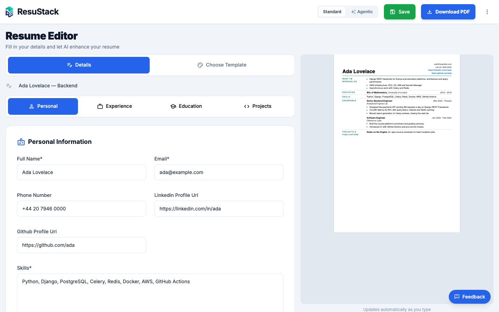
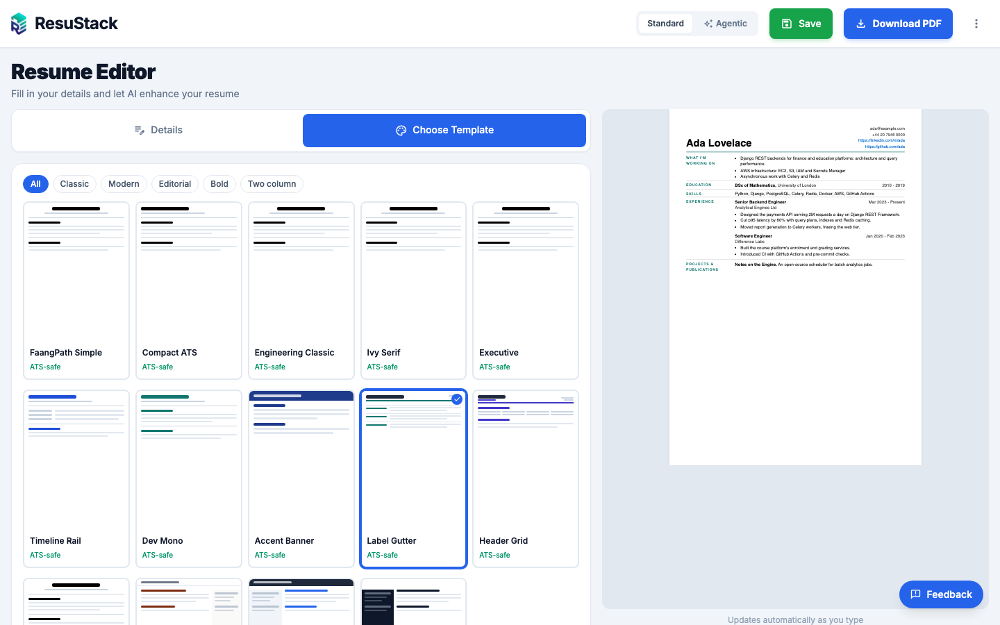
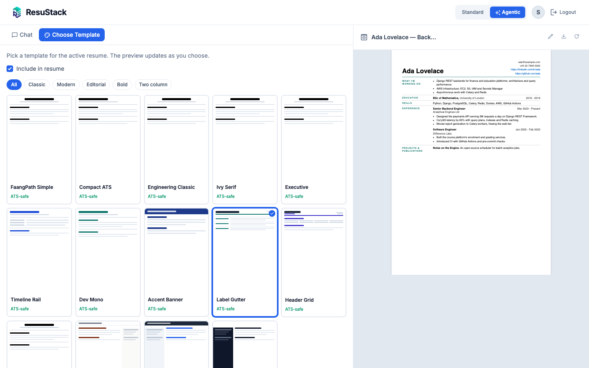
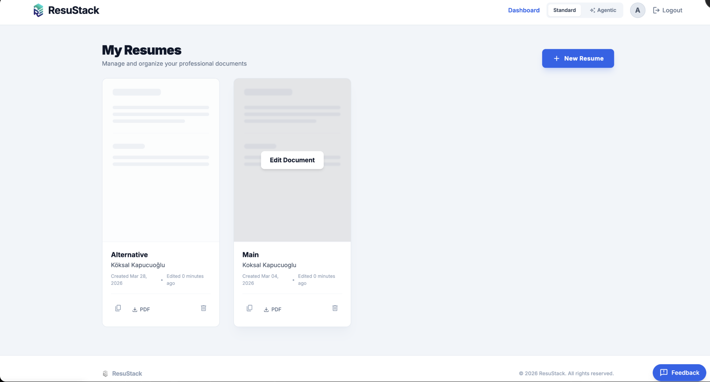

# ResuStack

**ResuStack** is an AI resume builder. Import a PDF or your LinkedIn profile, pick one of 14 designs, and edit by form or by chat — in the browser, or straight from Claude through its MCP server. Every change is reversible, and the PDF you download is rendered from the same template as the live preview.

🔗 **Live:** [resustackapp.com](https://resustackapp.com)

---

## ✨ Features

### Resume builder
- **PDF & LinkedIn import** — upload an existing resume or a LinkedIn PDF; AI extracts and structures it
- **Split-pane editor** — the form on the left, a live preview on the right, with page breaks where the PDF will break
- **14 designs on 6 layouts** — single column, banner, label gutter, header grid, left sidebar and right rail; ATS-safe designs are marked, and switching keeps your content
- **English and Turkish resumes** — headings, "Present", month names and degree phrasing print in the language the resume is written in
- **"What I'm working on"** — an optional section above Education, shown only when you tick it
- **Sign in with Google** — or with a username and password; email sign-ups confirm their address before using the AI features
- **PDF export** — rendered with WeasyPrint from the same template the preview uses

### AI
- **One-click enhance** — rewrites experience and project descriptions into stronger bullet points
- **Analyze and compare** — score a resume and see where it is weak, or compare two versions
- **Guided build** — build a resume step by step through questions

### Agentic mode
- **Edit by chatting** — *"Make my last role sound more senior"*; the agent uses tools, streams its progress and asks for approval before destructive actions
- **Template pane** — pick a design for the active resume without leaving the chat
- **Undo** — revert the last change from the conversation

### Change history
- A restore point before every save and every AI or MCP edit
- Diff any version against the current one, and restore it — on every plan

### Job applications
- **Match** a resume against a job posting and **tailor** a version for it
- **Track** applications, each with a snapshot of the exact resume you sent; clone a snapshot back into an editable resume

### Language versions
- Translate a resume in place, or create a translated copy linked to the original

---

## 🤖 Use ResuStack from Claude (MCP)

ResuStack is a [Model Context Protocol](https://modelcontextprotocol.io) server. Claude — or any MCP client with Streamable HTTP and custom headers — writes the resume; ResuStack stores it, versions it and renders it.

**1. Create a token.** Sign in, open **Profile → API token**, and create one. It is shown once; replacing it revokes the old one. The Profile page also shows the endpoint address to use.

**2. Add the server.** With Claude Code:

```bash
claude mcp add --transport http resustack https://resustackapp.com/mcp --header "Authorization: Bearer YOUR_TOKEN"
```

Authentication is a bearer token only; session cookies are not accepted on this endpoint.

**3. Ask.** *"List my resumes"*, *"Switch my CV to the Label Gutter design and give me the PDF"*, *"Fill What I'm working on from what we did this month."*

### Tools

| Tool | What it does |
|---|---|
| `list_resumes` | Resumes on the account: id, title, language, template |
| `get_resume` | The full stored content of one resume |
| `create_resume` | Create a resume from structured content |
| `update_resume` | Replace a resume's content (read it first — this is a replace, not a merge) |
| `set_focus_areas` | Set only the "What I'm working on" section; the rest of the resume is untouched |
| `list_templates` | The designs, with a description and whether each is ATS-safe |
| `set_template` | Change a resume's design |
| `render_pdf` | A download link for the PDF — single use, expires in 10 minutes |
| `check_quota` | What the account has left this month |

### Prompts

| Prompt | What it does |
|---|---|
| `focus_areas_from_my_work` | Has the client's model summarise the work you have actually done — from the conversations it can see — into a few lines, show them to you, and save them with `set_focus_areas` only after you approve |

### Safety rules
- Every write takes a restore point first; you can undo it on the website
- There is no delete tool — removing a resume stays on the website, where a person clicks
- Every query is scoped to the token's owner
- Rate limited per account

### Listing in the MCP Registry

`server.json` at the repository root describes the server for the [official MCP Registry](https://modelcontextprotocol.io/registry/about) as `com.resustackapp/resustack`. Publishing under that name requires proving ownership of `resustackapp.com` with a file served at `/.well-known/mcp-registry-auth`:

1. Generate a key pair locally. Never commit `key.pem` (it is in `.gitignore`):

   ```bash
   openssl genpkey -algorithm Ed25519 -out key.pem
   ```

2. Print the proof record and set it as the `MCP_REGISTRY_AUTH` environment variable in Dokploy, then redeploy:

   ```bash
   echo "v=MCPv1; k=ed25519; p=$(openssl pkey -in key.pem -pubout -outform DER | tail -c 32 | base64)"
   ```

3. Check it is live:

   ```bash
   curl https://resustackapp.com/.well-known/mcp-registry-auth
   ```

4. Log in and publish from the repository root:

   ```bash
   mcp-publisher login http --domain resustackapp.com --private-key "$(openssl pkey -in key.pem -noout -text | grep -A3 'priv:' | tail -n +2 | tr -d ' :\n')"
   ```

   ```bash
   mcp-publisher publish
   ```

Bump `version` in `server.json` (and `SERVER_INFO` in `mcp_server/protocol.py`) for each new listing.

---

## 📸 Screenshots

### Editor — form, live preview and the template pane


### Choosing a design


### Agentic mode


### Dashboard


---

## 💳 Plans

Free to start. Pro is a **one-time purchase for a period** — no subscription.

| Free plan | Limit |
|---|---|
| Resumes | 3 |
| PDF or LinkedIn imports | 2 / month |
| AI enhancements | 10 / month |
| PDF downloads | 5 / month |
| Agent chat messages | 10 / month |
| Tracked applications | 3 |
| Restore points per resume | 5 |

Pro removes these limits. Current prices are on the [pricing page](https://resustackapp.com/pricing/). Limits live in `FREE_TIER_LIMITS` in `core/settings.py`.

---

## 🚀 Running locally

### Prerequisites
- Docker & Docker Compose
- An OpenAI API key

### 1. Clone and configure

```bash
git clone https://github.com/koksalkapucuoglu/resume-enhance.git
```

```bash
cd resume-enhance && cp .env.example .env
```

| Variable | Description | Example |
|---|---|---|
| `OPENAI_API_KEY` | OpenAI API key | `sk-proj-...` |
| `SECRET_KEY` | Django secret key | any long random string |
| `DEBUG` | Debug mode | `True` |
| `ALLOWED_HOSTS` | Allowed hosts | `localhost,127.0.0.1` |
| `POSTGRES_DB` / `POSTGRES_USER` / `POSTGRES_PASSWORD` | Database credentials | `postgres` |
| `POSTGRES_HOST` / `POSTGRES_PORT` | Database address | `db` / `5432` |
| `EMAIL_HOST_USER` / `EMAIL_HOST_PASSWORD` | SMTP credentials for password resets and email verification; for Gmail, an app password | `you@gmail.com` / app password |
| `EMAIL_HOST` / `EMAIL_PORT` / `EMAIL_USE_TLS` / `EMAIL_USE_SSL` | SMTP server; defaults to Gmail (`smtp.gmail.com`, `587`, TLS). For implicit TLS on 465, set `EMAIL_USE_SSL=True` | `smtp.gmail.com` / `587` / `True` / `False` |
| `DOWNLOAD_LINK_MAX_AGE` | Seconds a signed PDF link stays valid (optional) | `600` |
| `GOOGLE_OAUTH_CLIENT_ID` / `GOOGLE_OAUTH_CLIENT_SECRET` | Google sign-in; the button stays hidden until both are set (optional) | from Google Cloud Console |
| `DEFAULT_FROM_EMAIL` | Sender for account emails; defaults to `EMAIL_HOST_USER` (optional) | `ResuStack <you@gmail.com>` |
| `MCP_REGISTRY_AUTH` | MCP Registry domain proof served at `/.well-known/mcp-registry-auth` (optional, public key only) | `v=MCPv1; k=ed25519; p=...` |
| `PAYMENT_STATUS` | `coming_soon` shows plans without taking payment; `live` enables checkout | `coming_soon` |
| `PAYMENT_PROVIDER`, `PAYMENT_WEBHOOK_SECRET`, `CHECKOUT_URL_*`, `PRODUCT_ID_*` | Payment provider settings (optional) | |

### 2. Start

```bash
docker compose up --build
```

The app runs at [http://localhost:8000](http://localhost:8000).

### 3. Run the tests

```bash
docker compose exec web python manage.py test resume mcp_server
```

WeasyPrint and OpenAI are mocked in the unit tests; no API calls are made.

---

## ☁️ Deployment

Production runs on **[Dokploy](https://dokploy.com)**. Every push to `main` triggers a deploy through a GitHub webhook: Dokploy builds the `Dockerfile`, and `entrypoint.sh` runs `migrate` and `collectstatic` before starting Gunicorn. Traefik handles HTTPS.

Setting it up on a new server:
1. Install Dokploy: `curl -sSL https://dokploy.com/install.sh | sh`
2. Open `http://YOUR_SERVER_IP:3000` and create an admin account
3. Create a project → add an **Application** → connect this GitHub repository
4. Add a **PostgreSQL** service in the same project
5. Set the environment variables (see `.env.prod.example`) and the domain, then deploy

Notes:
- Leave Dokploy's **Run Command** empty — the Dockerfile's `ENTRYPOINT` does everything
- Behind Cloudflare's proxy, set Dokploy's domain encryption to **None** and Cloudflare SSL to **Full**
- The image installs the fonts the resume designs use; nothing is fetched at render time

`docker-compose.prod.yml` and the `Caddyfile` are kept for self-hosting without Dokploy; they are not what production uses.

---

## 🔑 Google sign-in

Sign-in with Google uses [django-allauth](https://docs.allauth.org). ResuStack's own login, sign-up and password pages stay in charge; allauth adds only the Google flow.

1. In [Google Cloud Console](https://console.cloud.google.com/apis/credentials), configure the **OAuth consent screen** (External), with the privacy policy URL `https://resustackapp.com/privacy/` and only the `openid`, `email` and `profile` scopes.
2. Create an **OAuth client ID** of type *Web application* with:
   - Authorized JavaScript origin: `https://resustackapp.com`
   - Authorized redirect URI: `https://resustackapp.com/accounts/google/login/callback/`
   - For local development, also `http://localhost:8000/accounts/google/login/callback/`
3. Set `GOOGLE_OAUTH_CLIENT_ID` and `GOOGLE_OAUTH_CLIENT_SECRET` and redeploy.

How it behaves:
- A Google account is never attached to an existing ResuStack account because the email matches — local addresses were never verified. Existing users connect Google from their Profile page while signed in.
- New Google users pass through a short step to pick a username and give consent to transfers abroad.
- Google accounts with an unverified email are refused.
- Accounts created with an email address work at once, but AI features stay locked until the address is confirmed (soft verification). Accounts created before this existed are not affected.

---

## 🔒 Privacy

What ResuStack collects, who processes it (including OpenAI for AI features) and how to delete it: [resustackapp.com/privacy](https://resustackapp.com/privacy/). The Turkish version, written as the KVKK information notice, is at [resustackapp.com/gizlilik](https://resustackapp.com/gizlilik/). Users can delete their account and all its data from the Profile page.

---

## 🏗️ Architecture

Monolithic Django: views, DRF API, an MCP endpoint, WeasyPrint for PDFs, OpenAI for parsing and writing. Resume content is a single `JSONField`; every design comes from one catalogue in `resume/resume_templates.py`. The full guide — conventions, patterns and pitfalls — is in [`.claude/CLAUDE.md`](.claude/CLAUDE.md).

---

## 🗺️ Roadmap

- [x] Multiple resume designs (14)
- [x] Job description matching and application tracking
- [x] Agentic mode with tool calling, approvals and undo
- [x] Change history with diff and restore
- [x] MCP server for Claude and other clients
- [x] English and Turkish resumes
- [ ] Listing in MCP registries
- [ ] OAuth for MCP clients, alongside tokens
- [ ] Payments going live

---

## License

Open Source.
